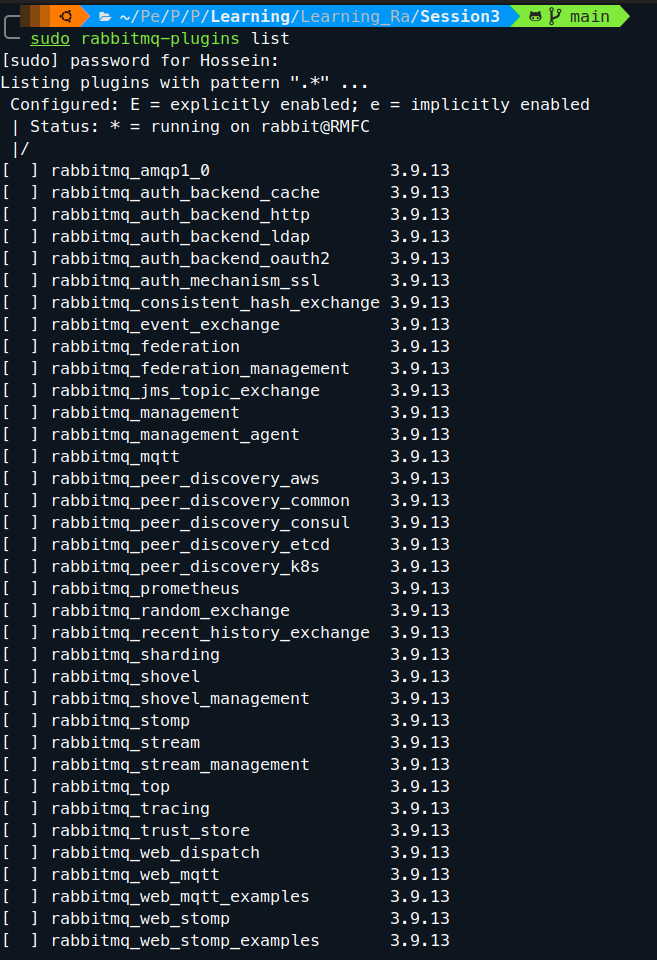
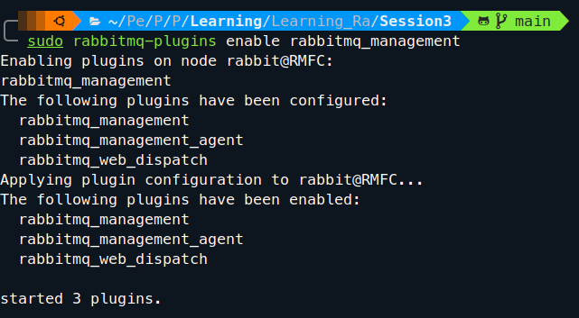

# 🐇 AMQP: Advanced Message Queuing Protocol

AMQP is an acronym for **Advanced Message Queuing Protocol**. It provides a standardized way for different applications to communicate with each other using a message-oriented middleware approach. In AMQP, messages are published by a *publisher*, routed through an *exchange*, and then placed in a *queue* for consumption by a *consumer*.

## 📚 AMQP Architecture Components

The AMQP architecture consists of the following components:

- **Publisher**: The entity responsible for creating and sending messages to the exchange.
- **Exchange**: Receives messages from publishers and routes them to queues based on specific criteria defined by the exchange type.
- **Queue**: Stores messages until they are consumed by consumers.
- **Consumer**: Retrieves messages from the queue and processes them.

## 🔄 Exchange Types

AMQP supports different exchange types, each with its own routing behavior:

1. **Direct Exchange**: Messages are routed to queues based on a ***routing key***. The routing key specified by the publisher must match the name of the queue.
   
      

2. **Fanout Exchange**: Messages are broadcasted to all queues connected to the exchange. Queues do not have names, and all messages sent by the publisher are forwarded to all queues.
   
      

3. **Topic Exchange**: Messages are routed to queues based on matching patterns between the routing key specified by the publisher and the queue names. Both the routing key and queue names can contain wildcards, allowing for flexible message routing.

    
   
4. **Header Exchange**: Messages are routed to queues based on matching header values. The publisher includes headers with the message, and the queues have header definitions specifying which headers and values they are interested in. The `x-match` key in the queue's header configuration determines how many headers need to match for a message to be routed to the queue.

     

**Note:Consumers are connected to the Broker through multiple channels and they are not connected to the Broker directly.

## 🧩 Plugins

Plugins in RabbitMQ provide additional functionality and features. Here are some useful commands related to plugins:

- `rabbitmq-plugins --help`: Displays help information for the plugin-related commands.
  
- `rabbitmq-plugins list`: Lists all available plugins.
  
  

- `rabbitmq-plugins enable rabbitmq_management`: Enables the RabbitMQ management plugin, which provides a web interface for managing RabbitMQ.
  
  

- After enabling the management plugin, you can access the management interface at `http://localhost:15672/` with the default credentials: username: guest, password: guest.
- `rabbitmq-plugins list -e`: Lists enabled plugins. (Explicit)
- `rabbitmq-plugins list -E`: Lists enabled plugins. (Explicit & Implicit)
- `rabbitmq-plugins list -m`: Lists plugins. (Minimal Version)
- `rabbitmq-plugins list -v`: Lists plugins. (Verbose Version)
- `rabbitmq-plugins directories`: Displays the directories where RabbitMQ plugins are installed.
- `rabbitmq-plugins disable Plugin-Name`: This will disable the plugin that you want.

## 🔒 Authentication and Authorization

Authentication and authorization are important aspects of securing RabbitMQ.

- **Authentication**: Verifies the identity of the user trying to access RabbitMQ. It ensures that the user is who they claim to be.
- **Authorization**: Determines the permissions and access rights of authenticated users.

Use the following commands with `rabbitmqctl` to manage users and their permissions:

- `rabbitmqctl add_user "username" "password"`: Adds a new user with the specified username and password.

- `rabbitmqctl list_users`: Lists all configured users.

- `rabbitmqctl set_user_tags "username" "tag"`: Sets tags for a user. Common tags are "administrator" and "monitoring".

- `rabbitmqctl set_permissions -p "host_name" "username" "configure_permission" "read_permission" "write_permission"`: Sets permissions for a user on a specific virtual host. The permissions include configure, read, and write operations.
  - `rabbitmqctl set_permissions -p "/" "root" ".*" ".*" ".*"` 

- `rabbitmqctl delete_user "username"`: Deletes a user.

**Notice:**
When you create a user and even give the user administrator tag it will still need the `set_permission` for using a specified host and the default host is "/".

By default, RabbitMQ has a default virtual host named `/` (a slash) and a default user with the username "guest" and password "guest".

- `rabbitmqctl list_queue`: Lists all queues .

## Round Robin

This algorithm will receive all the requests and will distribute them from top server to the bottom one, one by one.
for example if we have 100 requests and 3 servers it will give one to first server, one to the second server and one to the third server and again loop through them and give another request to first server and ...

### Note: 
By default RabbitMQ use the Round Robin algorithm but with prefetch_count you can
change the way rabbitmq behave in distributing the request at the beginning.