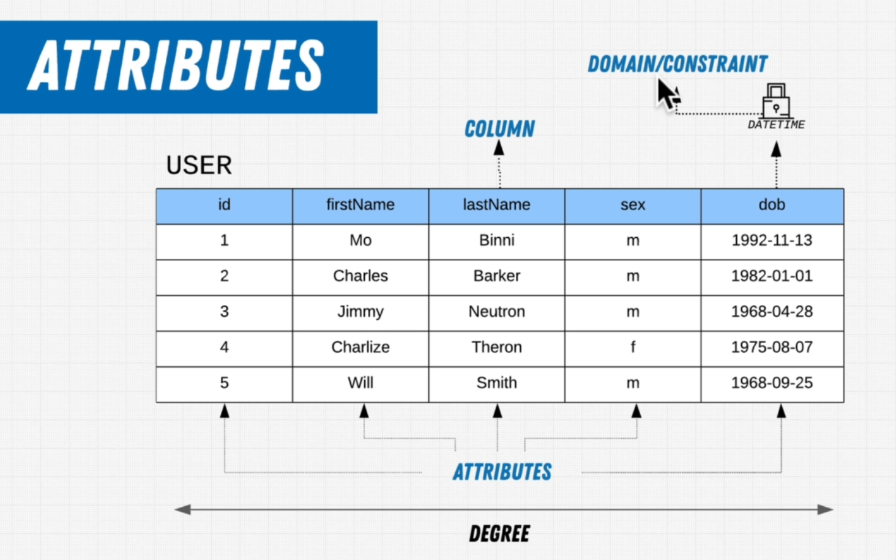
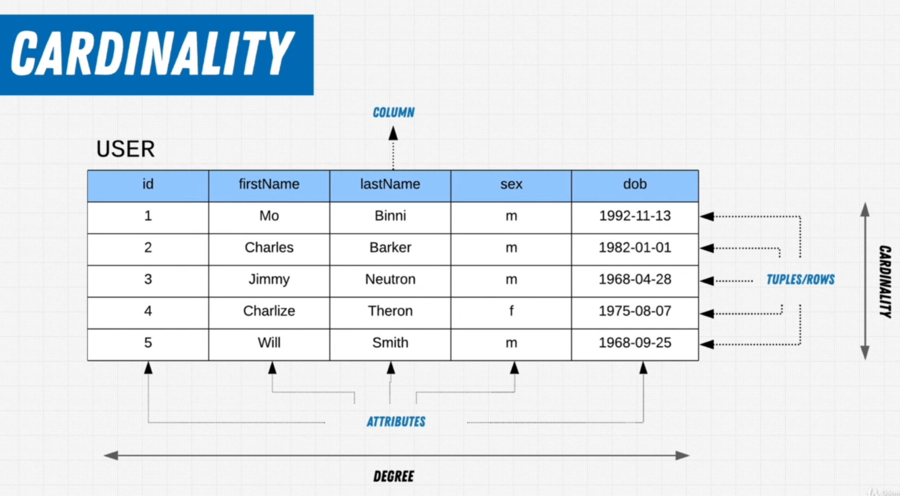
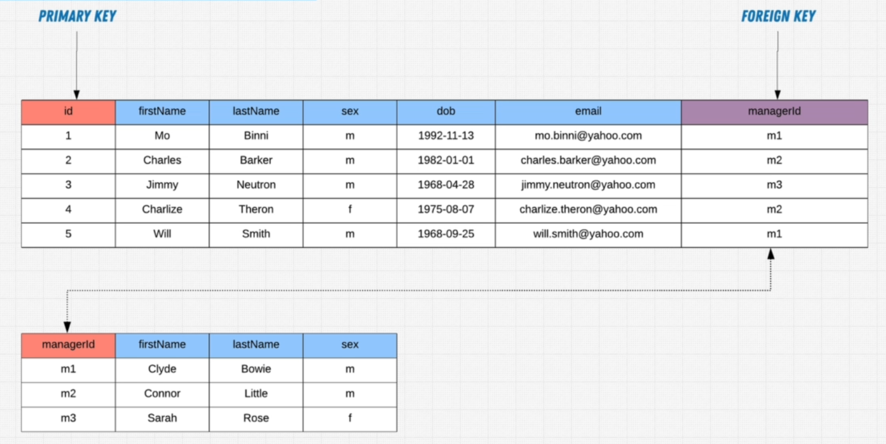
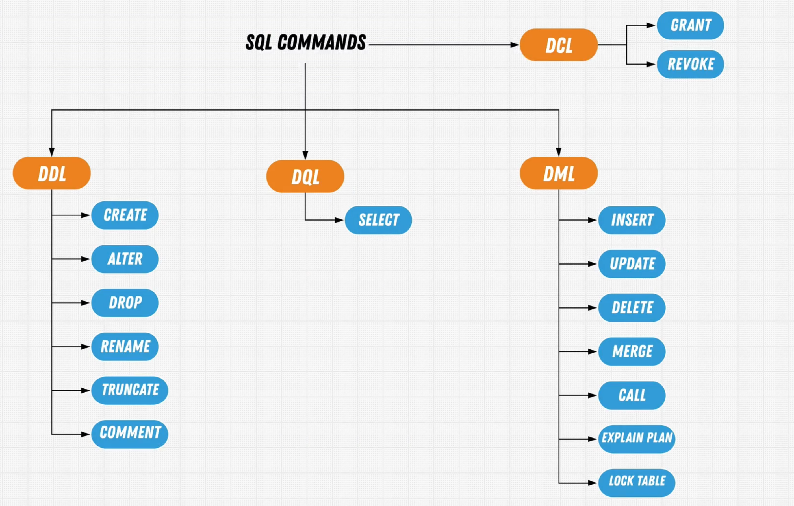

# SQL: 

`SQL` stands for **Structured Query Language**. This language is to query or modify our data.
Like many other languages `SQL` is Declerative which means we don't care about how, we care about what.

Before Data Base, we had `File Processing System` and it had lots of pros but it's cons were way more.
</br>


<br>

## Database Models:
- **Hierarchical Model:** Known as One-To-Many, cause each child can only have one parent.


- **Networking Model:** Known as Many-To-Many, it's a more developed version of Hierarchical Model.


- **Relational Model:** No more Parent-Child Structure, instead it's Table Structure.


## DBMS: Data Base Management Software

Different companies create different softwares with various features to compeate with eachother.

- **CRUD Operations**
    - Create
    - Reade
    - Update
    - Delete

- **Manage Data**
- **Security & Permissions**
- **Transaction Management**


## Declarative VS IMPERATIVE

### Declarative:


### Impearative: 


## DBMS

`DBMS` stands for **Database Management System**.

- **Relational:** Datas are structured in to tables.
    - MySQL
    - PostgreSQL
    - Oracel

- **Non Relational:** (NoSQL)
    - Document
        - MongoDB
        - CouchDB
        - FireBase

    - Key Value    
        - Redis

    - Graph
        - Neo4J
        - GraphQL

    - Wide Columnar
        - Cassandre


## Tables


- **Columns / Attribute / Domain:** <br>
    Each column has a name and a collection of columns is called `Degree`. We can be Constraint about the domain of a column data, for example in the firstName and lastName we only want string and in the dob we only want date and in the sex column we only want m or f character.
    

- **Rows / Tuples:**<br>
    The collection of Rows is called Cardinality.
    

- **Primary Key:**<br>
    A key that will be the unique identifier of each row in a table.
- **Foreign Key:**<br>
    A key that will reference the primary key, the unique identifier of a different table, therefore allowing a relationship to be formed that is solidified  in stone.
    
<br>

## OLTP Vs OLAP:

- **OLTP: OnLine Transaction Processing**<br>
`(Support Day To Day)`<br>
OLTP systems are optimized for handling a large volume of short, real-time transactions. 

- **OLAP:Online Analytical Processing**<br>
`(Support Analysis)`<br>
OLTP systems are optimized for handling a large volume of short, real-time transactions, while OLAP systems focus on complex analysis of large, historical datasets to support decision-making.


## SQL Commands


### DCL: Data Control Language
- Grant
- Revoke

### DDL: Data Definition Language
- CREATE
- ALTER
- DROP
- RENAME
- TRUNCATE
- COMMENT

### DQL: Data Query Language
- SELECT

### DML: Data Modification Language
- INSERT
- UPDATE
- DELETE
- MERGE
- CALL
- EXPLAIN PLAN
- LOCK TABLE

## Retrive Data from ***One*** Table:

- **USE**

    Choose a database with this keyword.

    - Example:

        ```SQL
        USE store_database;
        ```
<br>

- **SELECT**

    Select the columns form the table we want.

    - Example:

        ```SQL
        SELECT first_name, last_name FROM customers;
        ```

        ```SQL
        SELECT
            first_name,
            last_name,
            point * 10,
        FROM customers;
        ```
<br>

- **FROM**

    Choose the table which you want.

    - Example:

        ```SQL
        SELECT * FROM customers;
        ```
<br>

- **WHERE**

    return the results which saticfy the statment infront of ` WHERE`.

    - Example:

        ```SQL
        SELECT * FROM customers WHERE customer_id = 1;
        ```
<br>

- **ORDER BY**

    Order the output base on what we want.

    - Example:

        ```SQL
        SELECT * FROM customers
        ORDER BY first_name;
        ```

        ```SQL
        SELECT * FROM customers
        ORDER BY first_name DESC, last_name DESC;
        ```
<br>

- **AS**

    Shows the selected columns as the way you want.

    - Example:

        ```SQL
        SELECT 
            (points * 10) AS 'discount_factor'
        FROM customers 
        ORDER BY first_name;
        ```

<br>

- **DISTINCT**

    This will remove the duplicates.

    - Example:

        ```SQL
        SELECT DISTINCT city
        FROM customers;
        ```
<br>

- **AND / OR / NOT**

    `AND` is always higher than `OR`, so it will be executed faster.

    - Example:

        ```SQL
        SELECT * 
        FROM cutomers
        WHERE points > 100 
        OR birth_date >= '1999-01-01';
        ```

        ```SQL
        SELECT *
        FROM order_items
        WHERE order_id = 6 
        AND unit_price * quantity > 30;
        ```

<br>

- **IN**

    `AND` is always higher than `OR`, so it will be executed faster.

    - Example:

        ```SQL
        SELECT * 
        FROM cutomers
        WHERE city NOT IN ('VA', 'FL', 'GA');
        ```

<br>

- **BETWEEM**


    - Example:

        ```SQL
        SELECT * 
        FROM cutomers
        WHERE points BETWEEN 1000 AND 2000
        ```

<br>

- **LIKE**

    We ukse `LIKE` operator to match patterns.

    - **Example:**

        Customers with b in the start of their name !
        ```SQL
        SELECT * 
        FROM cutomers
        WHERE last_name LIKE 'b%';
        ```

        Customers with letter b in their names.
        ```SQL
        SELECT * 
        FROM cutomers
        WHERE last_name LIKE '%b%';
        ```

        Customers with 5 letter length last name and ends with letter y.
        ```SQL
        SELECT * 
        FROM cutomers
        WHERE last_name LIKE '_____y';
        ```
        ```SQL
        SELECT *
        FROM customers
        WHERE address LIKE '%AVENUE%' OR 
            address LIKE '%TRAIL%';
        ```

<br>

- **REGEXP**

    We use `REGEXP` for regex expressions.
    
        - ^ : Beginning

        - $ : End
        
        - | : Logical Or
        
        - [abcd] : one of these characters
        
        - [a-h]  : Range of characters
    
    - Example:

        ```SQL
        SELECT *
        FROM customers
        WHERE last_name REGEXP 'field'
        ```

- **IS NULL**

    To find the rows with a ` NULL` value.

    - Example:

        ```SQL
        SELECT * 
        FROM cutomers
        WHERE phone IS NULL
        ```


- **LIMIT**

    With `LIMIT` we set limitation for the number of results which we get from the query.

    - Example:

        ```SQL
        SELECT * 
        FROM customers
        LIMIT 10;
        ```
        The first number infront of `LIMIT ` is offset which means the number of rows to skip and the second of is the number of rows which we want.

        ```SQL
        SELECT * 
        FROM customers
        LIMIT 6, 3;
        ```

## Retrive Data from ***Multiple*** Table:

- **INNER JOIN / ON:**<br>
`INNER JOIN` Can be used to connect two tables from the same database or even different databases.
    - Example:
        ```sql
        SELECT order_id,orders.customer_id, first_name, last_name
        FROM orders
        INNER JOIN customers
                ON orders.customer_id = customers.customer_id
        ```
        ```sql
        USE sql_store;
        
        SELECT *
        FROM order_items io
        JOIN sql_inventory.porducts p
            ON oi.product_id = p.product_id
        ```